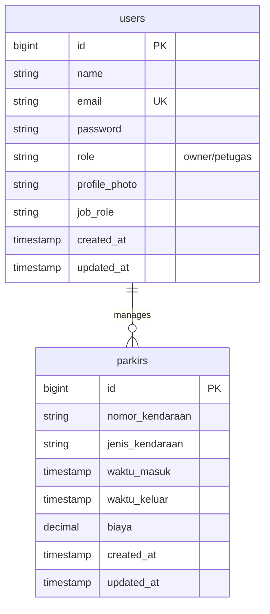
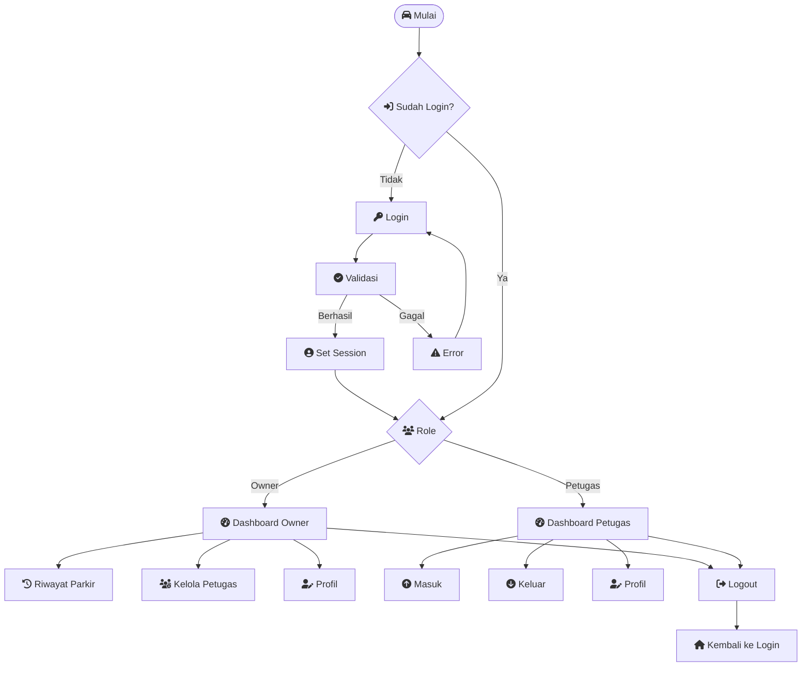

# ParkirByFerdi

Aplikasi Parkir Web berbasis Laravel untuk manajemen parkir dengan role `Owner` dan `Petugas`.

## Deskripsi Singkat

**ParkirByFerdi** adalah aplikasi web manajemen parkir yang dibangun menggunakan framework Laravel. Aplikasi ini dirancang untuk memudahkan pengelolaan parkir dengan sistem role-based access control yang terdiri dari dua jenis pengguna: **Owner** dan **Petugas**.

### Tujuan Aplikasi:
Aplikasi ini bertujuan untuk mengotomatisasi proses parkir mulai dari pendaftaran kendaraan masuk hingga pembayaran saat keluar. Dengan fitur-fitur modern seperti kalkulasi biaya otomatis, manajemen data petugas, dan antarmuka pengguna yang intuitif, aplikasi ini cocok digunakan untuk area parkir kecil hingga menengah.

### Teknologi yang Digunakan:
- **Backend**: Laravel Framework (PHP)
- **Database**: MySQL
- **Frontend**: Bootstrap 5, Font Awesome, CSS Custom
- **Authentication**: Laravel Breeze/Auth
- **File Storage**: Laravel Storage untuk upload foto profil

### Fitur Utama:
- Sistem autentikasi dengan role Owner dan Petugas
- Input data kendaraan masuk dengan cetak tiket
- Proses kendaraan keluar dengan kalkulasi biaya otomatis
- Dashboard owner untuk monitoring dan manajemen petugas
- Dashboard petugas untuk operasional harian
- Upload dan manajemen foto profil pengguna
- Antarmuka modern dengan efek glassmorphism

Aplikasi ini dibuat sebagai proyek akhir mata kuliah pemrograman web untuk mendemonstrasikan kemampuan dalam membangun aplikasi web full-stack dengan Laravel.

## Fitur Utama

- Autentikasi `Login`
- Role `Owner` dan `Petugas`
- Dashboard owner dengan:
  - Riwayat parkir
  - Kelola petugas
  - Edit profil
- Dashboard petugas dengan:
  - Input kendaraan masuk
  - Input kendaraan keluar
  - Kalkulasi biaya otomatis
  - Cetak nota parkir
  - Edit profil
- Upload dan tampilkan foto profil pengguna
- UI modern dengan tema glassmorphism

## Instalasi & Jalankan

1. Buat proyek baru dengan Composer:
   ```bash
   composer create-project --prefer-dist laravel/laravel ParkirByFerdi
   cd ParkirByFerdi-main
   ```
2. Salin file environment:
   ```bash
   copy .env.example .env
   ```
3. Atur konfigurasi database di `.env`
4. Install dependensi PHP tambahan jika diperlukan:
   ```bash
   composer install
   ```
5. Generate app key:
   ```bash
   php artisan key:generate
   ```
6. Jalankan migrasi dan seeder (jika diperlukan):
   ```bash
   php artisan migrate
   php artisan db:seed
   ```
7. Buat symbolic link storage:
   ```bash
   php artisan storage:link
   ```
8. Jalankan aplikasi:
   ```bash
   php artisan serve
   ```

## Struktur Penting

- `app/Http/Controllers/UserController.php` - kontrol profil dan upload foto
- `app/Models/User.php` - model user dengan accessor `profile_photo_url`
- `resources/views/layouts/master.blade.php` - layout utama dan CSS global
- `resources/views/admin/dashboard.blade.php` - dashboard owner
- `resources/views/admin/owner_profile.blade.php` - halaman profile owner
- `resources/views/admin/petugas_profile.blade.php` - halaman profile petugas
- `routes/web.php` - rute aplikasi

## Alur Aplikasi

1. Pengguna akses aplikasi
2. Halaman login muncul jika belum login
3. Setelah login, role dicek:
   - `Owner` ke dashboard owner
   - `Petugas` ke dashboard petugas
4. Petugas bisa input data kendaraan masuk/keluar
5. Owner bisa kelola petugas dan melihat riwayat
6. Semua pengguna dapat mengubah profil dan foto

## Struktur Basis Data dan SQL

### Struktur Tabel

#### Tabel `users`
```sql
CREATE TABLE users (
    id BIGINT UNSIGNED AUTO_INCREMENT PRIMARY KEY,
    name VARCHAR(255) NOT NULL,
    email VARCHAR(255) UNIQUE NOT NULL,
    email_verified_at TIMESTAMP NULL,
    password VARCHAR(255) NOT NULL,
    remember_token VARCHAR(100) NULL,
    role VARCHAR(255) DEFAULT 'petugas',
    profile_photo VARCHAR(255) NULL,
    job_role VARCHAR(255) NULL,
    created_at TIMESTAMP NULL,
    updated_at TIMESTAMP NULL
);
```

#### Tabel `parkirs`
```sql
CREATE TABLE parkirs (
    id BIGINT UNSIGNED AUTO_INCREMENT PRIMARY KEY,
    nomor_kendaraan VARCHAR(255) NOT NULL,
    jenis_kendaraan VARCHAR(255) NOT NULL,
    waktu_masuk TIMESTAMP NOT NULL,
    waktu_keluar TIMESTAMP NULL,
    biaya DECIMAL(10,2) NULL,
    created_at TIMESTAMP NULL,
    updated_at TIMESTAMP NULL
);
```

### Entity Relationship Diagram (ERD)



### Contoh Perintah SQL CRUD

#### 1. Tambah Data (INSERT)

**Tambah User Baru (dari UserController::store):**
```sql
INSERT INTO users (name, email, role, password, email_verified_at, created_at, updated_at)
VALUES ('John Doe', 'john@example.com', 'petugas', '$2y$10$hashedpassword', NOW(), NOW(), NOW());
```

**Tambah Data Parkir Masuk (dari ParkirController::simpanMasuk):**
```sql
INSERT INTO parkirs (nomor_kendaraan, jenis_kendaraan, waktu_masuk, created_at, updated_at)
VALUES ('B 1234 ABC', 'Mobil', NOW(), NOW(), NOW());
```

#### 2. Ubah Data (UPDATE)

**Update Profil User (dari UserController::updateProfile):**
```sql
UPDATE users
SET name = 'John Updated', profile_photo = 'profile_photos/photo.jpg', updated_at = NOW()
WHERE id = 1;
```

**Update Data Parkir Keluar (dari ParkirController::simpanKeluar):**
```sql
UPDATE parkirs
SET waktu_keluar = NOW(), biaya = 15000.00, updated_at = NOW()
WHERE id = 1;
```

#### 3. Hapus Data (DELETE)

**Hapus User (dari UserController::destroy):**
```sql
DELETE FROM users WHERE id = 2 AND role != 'owner';
```

#### 4. Pencarian Data (SELECT)

**Cari User berdasarkan Role (dari UserController::index):**
```sql
SELECT * FROM users ORDER BY role DESC, name ASC;
```

**Cari Kendaraan Aktif (belum keluar) - dari ParkirController::simpanMasuk:**
```sql
SELECT * FROM parkirs
WHERE nomor_kendaraan = 'B 1234 ABC' AND waktu_keluar IS NULL
LIMIT 1;
```

**Cari Riwayat Parkir (dari AdminController):**
```sql
SELECT * FROM parkirs ORDER BY created_at DESC;
```

**Hitung Total Petugas (dari UserController::ownerProfile):**
```sql
SELECT COUNT(*) as total FROM users WHERE role = 'petugas';
```
7. Logout kembali ke halaman login

## Diagram Alir (Sederhana)



## Catatan

- Pastikan `APP_URL` di `.env` sudah sesuai dengan alamat lokal yang digunakan.
- Foto profil disimpan di folder `storage/app/public/profile_photos`.

## Lisensi

MIT

